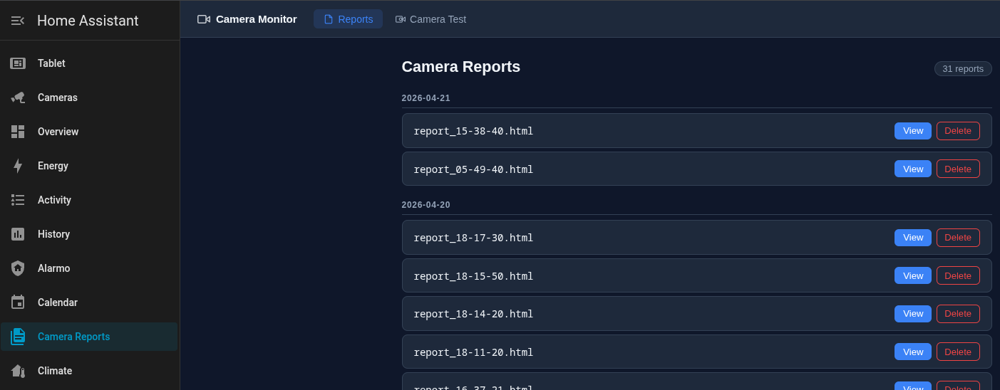

# Camera Event Report

A Home Assistant add-on that monitors cameras for motion events while you're away and generates HTML reports with screenshots. Reports are viewable directly in the HA sidebar and optionally sent by email.

## Features

- Monitors multiple cameras for motion via Home Assistant entity state changes
- Captures snapshots on motion events with configurable cooldown
- Generates timestamped HTML reports grouped by day
- Sends HA persistent notifications when you return home
- Optional email delivery via SMTP
- Built-in web panel accessible from the HA sidebar (ingress)
- Camera test panel to verify snapshot capture works
- Monitoring can be toggled via any HA entity (input_boolean, person, etc.)

## Installation

1. In Home Assistant, go to **Settings → Add-ons → Add-on Store**
2. Click the menu (⋮) → **Repositories** → add this URL:
   ```
   https://github.com/golaz777/HACameraEventReport
   ```
3. Find **Camera Event Report** in the store and click **Install**

## Configuration

| Option | Type | Description |
|--------|------|-------------|
| `cameras` | list | Cameras to monitor (see below) |
| `report.email.enabled` | bool | Enable email reports |
| `report.email.smtp_host` | string | SMTP server hostname |
| `report.email.smtp_port` | int | SMTP port (default: 587) |
| `report.email.smtp_user` | string | SMTP username |
| `report.email.smtp_password` | password | SMTP password |
| `report.email.recipient` | string | Report recipient email |
| `report.email.sender` | string | Sender email address |
| `notification.ha_persistent` | bool | Send HA persistent notification on return |
| `event_cooldown_seconds` | int | Minimum seconds between events per camera (default: 30) |
| `media_path` | string | Storage path for reports and snapshots (default: `/data/camera_events`) |
| `monitoring.toggle_entity` | string | HA entity to control monitoring on/off (e.g. `input_boolean.away_mode`) |

### Camera configuration

Each entry in `cameras` requires:

```yaml
cameras:
  - entity_id: camera.front_door
    motion_entity: binary_sensor.front_door_motion
    name: Front Door  # optional, defaults to entity_id suffix
```

### Example configuration

```yaml
cameras:
  - entity_id: camera.front_door
    motion_entity: binary_sensor.front_door_motion
    name: Front Door
  - entity_id: camera.backyard
    motion_entity: binary_sensor.backyard_motion
    name: Backyard

report:
  email:
    enabled: true
    smtp_host: smtp.gmail.com
    smtp_port: 587
    smtp_user: you@gmail.com
    smtp_password: your_app_password
    recipient: you@gmail.com
    sender: you@gmail.com

notification:
  ha_persistent: true

event_cooldown_seconds: 30
monitoring:
  toggle_entity: input_boolean.away_mode
```

## Screenshots



## How it works

1. Add-on subscribes to HA state changes
2. When `monitoring.toggle_entity` turns on (away), monitoring activates
3. Motion events trigger snapshot capture and are stored to disk
4. When toggle turns off (home), the add-on generates an HTML report for the away period
5. Report is saved to media folder, notification sent, and email dispatched if configured

Without `monitoring.toggle_entity`, monitoring does NOT run.

## Supported architectures

`aarch64` · `amd64` · `armhf` · `armv7` · `i386`

## AI Disclaimer

Parts of this project were developed with assistance from AI tools (Claude by Anthropic). All code has been reviewed and tested by the author. Use at your own risk.

## License

MIT
