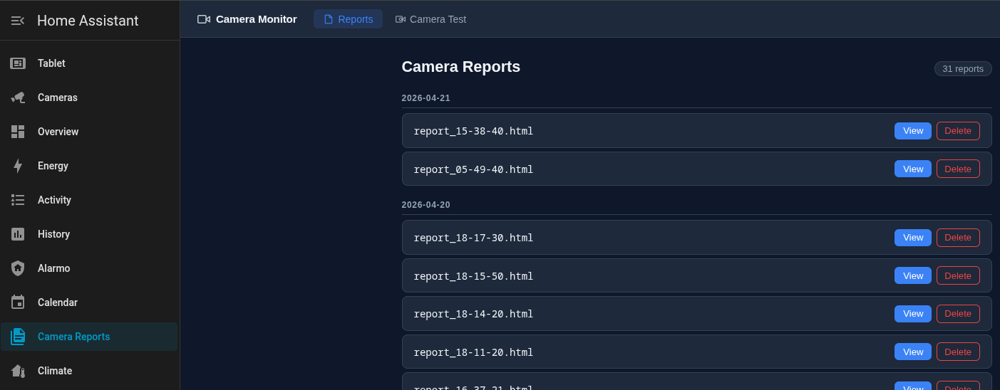

# Camera Event Report

A [Home Assistant](https://www.home-assistant.io) add-on that monitors cameras for motion events while you're away and generates HTML reports with screenshots. Reports are viewable directly in the HA sidebar and optionally sent by email.

## Features

- Monitors multiple cameras for motion via Home Assistant entity state changes
- Captures snapshots on motion events with configurable cooldown
- **Human detection** — analyses the session's snapshots on-device when you
  return and tells you whether a *person* was there, not just that something moved
- Generates timestamped HTML reports grouped by day
- Sends HA persistent notifications when you return home
- Optional email delivery via SMTP
- Built-in web panel accessible from the HA sidebar (ingress)
- **Live event stream dashboard** — real-time feed of motion events with snapshots, no refresh needed
- **Event filtering** — filter reports by date range and minimum event count
- **Analytics dashboard** — view motion patterns with per-day, per-camera, and hourly statistics
- Camera test panel to verify snapshot capture works
- Monitoring can be toggled via any HA entity (input_boolean, person, etc.)
- Automatic retention policy to purge event data older than a configurable number of days
- **Home Assistant entities and events** — monitoring state, motion counts and
  report results as entities, plus `camera_event_report_motion` /
  `camera_event_report_report_ready` events for your own automations
- **Evidence export** — download any report as a ZIP with the original
  snapshots, CSV/JSON event data and SHA-256 checksums

## Installation

1. In Home Assistant, go to **Settings → Add-ons → Add-on Store**
2. Click the menu (⋮) → **Repositories** → add this URL:
   ```
   https://github.com/golaz777/HACameraEventReport
   ```
3. Find **Camera Event Report** in the store and click **Install**

## Updating

Home Assistant only notices a new version after its add-on store cache is
refreshed. After a new version is pushed, do this:

1. Go to **Settings → Add-ons → Add-on Store**, open the menu (⋮) →
   **Check for updates**, then hard-refresh the browser (**Ctrl+F5**).
2. Open the add-on page — the **Update** button should now be available.
   Click **Update**.

**Always use Update, never Rebuild, to move to a new version.** Rebuild
re-builds the *currently installed* version from source and leaves the
installed version behind the store version, producing the error
*"Local and store versions of app Camera Event Report differ, use Update
instead of Rebuild."*

If the **Update** button stays greyed out after a store reload, the
Supervisor cache is stale. From the HA host terminal/SSH:

```bash
ha addons reload
ha addons info camera_event_report   # confirm the new version is offered
```

If it still won't budge, restart the Supervisor (**Settings → System → ⋮ →
Restart Supervisor**). Avoid uninstall/reinstall — that wipes the add-on
configuration.

## Configuration

| Option | Type | Description |
|--------|------|-------------|
| `cameras` | list | Cameras to monitor (see below) |
| `report.email.enabled` | bool | Enable email reports |
| `report.email.smtp_host` | string | SMTP server hostname |
| `report.email.smtp_port` | int | SMTP port (default: 587) |
| `report.email.smtp_user` | string | SMTP username |
| `report.email.smtp_password` | password | SMTP password |
| `report.email.recipient` | string | Report recipient email |
| `report.email.sender` | string | Sender email address |
| `notification.ha_persistent` | bool | Send HA persistent notification on return |
| `event_cooldown_seconds` | int | Minimum seconds between events per camera (default: 30) |
| `media_path` | string | Storage path for reports and snapshots (default: `/data/camera_events`) |
| `monitoring.toggle_entity` | string | HA entity to control monitoring on/off (e.g. `input_boolean.away_mode`) |
| `retention_days` | int (optional) | Delete event data older than this many days on startup (default: 30, leave empty to disable) |
| `detection.enabled` | bool | Analyse snapshots for people after monitoring ends (default: `true`) |
| `detection.confidence` | float | Minimum score (0–1) to count as a person (default: `0.4`) |
| `homeassistant.publish_entities` | bool | Publish the add-on's state as Home Assistant entities (default: `true`) |
| `homeassistant.fire_events` | bool | Fire `camera_event_report_*` events on the Home Assistant event bus (default: `true`) |

### Camera configuration

Each entry in `cameras` requires:

```yaml
cameras:
  - entity_id: camera.front_door
    motion_entity: binary_sensor.front_door_motion
    name: Front Door  # optional, defaults to entity_id suffix
```

### Example configuration

```yaml
cameras:
  - entity_id: camera.front_door
    motion_entity: binary_sensor.front_door_motion
    name: Front Door
  - entity_id: camera.backyard
    motion_entity: binary_sensor.backyard_motion
    name: Backyard

report:
  email:
    enabled: true
    smtp_host: smtp.gmail.com
    smtp_port: 587
    smtp_user: you@gmail.com
    smtp_password: your_app_password
    recipient: you@gmail.com
    sender: you@gmail.com

notification:
  ha_persistent: true

event_cooldown_seconds: 30
retention_days: 30
monitoring:
  toggle_entity: input_boolean.away_mode
detection:
  enabled: true
  confidence: 0.4
homeassistant:
  publish_entities: true
  fire_events: true
```

## Screenshots



## How it works

1. Add-on subscribes to HA state changes
2. When `monitoring.toggle_entity` turns on (away), monitoring activates
3. Motion events trigger snapshot capture and are stored to disk
4. When toggle turns off (home), every snapshot from the away period is analysed
   for human presence, then an HTML report is generated
5. Report is saved to media folder, notification sent, and email dispatched if configured

Without `monitoring.toggle_entity`, monitoring does NOT run.

### Human detection

Detection runs locally with a bundled SSD MobileNet V1 ONNX model — snapshots
never leave your hardware and no API key is needed. Analysis happens once, after monitoring
ends, so it costs nothing while you are away.

Each snapshot is marked **Human**, **Clear**, or **—** (not analysed, e.g. a
failed capture). The report summary and the Reports page both show how many
snapshots contained a person, and the verdicts are written into each day's
`events.json` as `human_detected` / `human_confidence` for your own automations.

Raise `detection.confidence` if you get false alarms; lower it if people are
being missed. Set `detection.enabled: false` to turn the feature off.

## Supported architectures

`aarch64` · `amd64` · `armhf` · `armv7` · `i386`

Human detection additionally requires `onnxruntime`, which has no wheels for
`armhf`, `armv7` or `i386`. On those architectures the add-on runs exactly as it
did before, logging one warning and skipping analysis — everything else works.

## AI Disclaimer

Parts of this project were developed with assistance from AI tools (Claude by Anthropic). All code has been reviewed and tested by the author. Use at your own risk.

## License

MIT
